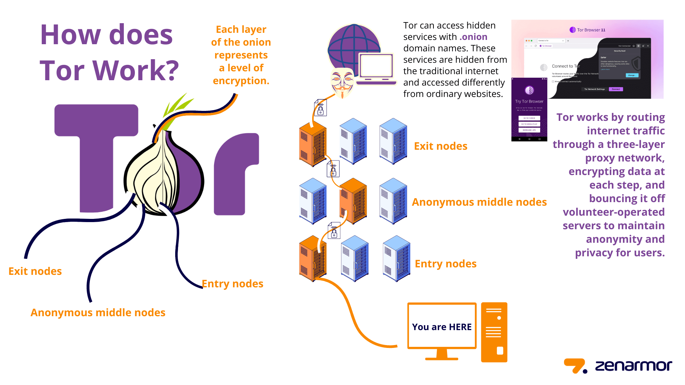

# Day 10: Cybersecurity – Wireshark and Tor Network

## 🧪 Wireshark: Network Protocol Analyzer

Wireshark is a **free and open-source packet analyzer**. It is widely used for **network troubleshooting**, **analysis**, **software and protocol development**, and **education**.

### 🔧 Key Features of Wireshark
- Captures network packets in real-time
- Deep inspection of hundreds of protocols
- Available on Windows, Linux, macOS
- Rich display filters to analyze specific traffic
- Supports live capture and offline analysis
- Export captured data in different formats (e.g., PCAP)

## 🎯 How to Use Wireshark

### Step 1: Install Wireshark
Download it from the official website: [https://www.wireshark.org](https://www.wireshark.org)

### Step 2: Choose a Network Interface
After launching Wireshark, select the network interface you want to monitor (e.g., Ethernet, Wi-Fi).

### Step 3: Start Capturing
Click the shark fin icon or double-click the interface to begin capturing packets.

### Step 4: Analyze Captured Data
Each row represents a captured packet. Columns include:
- **No.**: Packet number
- **Time**: Time since capture started
- **Source/Destination**: IP addresses
- **Protocol**: Protocol used (e.g., TCP, UDP)
- **Info**: Summary of packet content

### Step 5: Stop Capture
Click the red square button to stop.

### Step 6: Apply Display Filters
Use filters to narrow down results. Examples:
- `http` – Shows only HTTP packets
- `ip.addr == 192.168.1.1` – Filter traffic from/to a specific IP
- `tcp.port == 80` – Filter TCP traffic on port 80
- `dns` – Show DNS queries and responses
- `tcp contains "login"` – Show TCP packets containing the word "login"

### Step 7: Save and Export
Save captures in `.pcapng` or `.pcap` format for later analysis.

## 🧠 Common Use Cases of Wireshark
- Troubleshooting network latency
- Analyzing suspicious traffic or malware communication
- Debugging application protocols
- Network security auditing

## 🕸️ The Tor Network: Anonymity Online

### 🌐 What is Tor?
**Tor** (The Onion Router) is a free and open-source software for enabling **anonymous communication** on the Internet. It conceals a user's location and usage by directing traffic through a **volunteer overlay network** consisting of thousands of relays.

### 🧅 How Tor Works
1. **Encryption in Layers**: Tor encrypts data multiple times (like an onion).
2. **Relay Path**: Data is sent through a random path of 3 Tor relays:
   - **Entry Node**: Knows your IP, not the final destination
   - **Middle Relay**: Just forwards traffic
   - **Exit Node**: Sees the traffic's final destination but not your IP
3. Each relay decrypts a layer, revealing the next hop, until the exit node sends it to the destination.

*Image: A visual representation of Tor's multi-layered routing system.*

### ⚙️ How to Use Tor
- Download the **Tor Browser** from [https://www.torproject.org](https://www.torproject.org)
- Browse the internet anonymously using the browser
- Avoid logging into personal accounts or enabling browser scripts/plugins

### ⚠️ Limitations of Tor
- Slower speeds due to multi-hop routing
- Exit nodes can see unencrypted traffic (use HTTPS!)
- Some websites block Tor traffic

### 🔒 Benefits of Tor
- Protects against traffic analysis
- Enables censored or restricted access
- Maintains anonymity and privacy

---

**Conclusion:** On Day 10, we explored two powerful tools in cybersecurity:
- **Wireshark** helps monitor and analyze network activity in detail
- **Tor** provides anonymity and privacy in online communication

Both tools are crucial for understanding how data flows and how it can be secured or anonymized.

